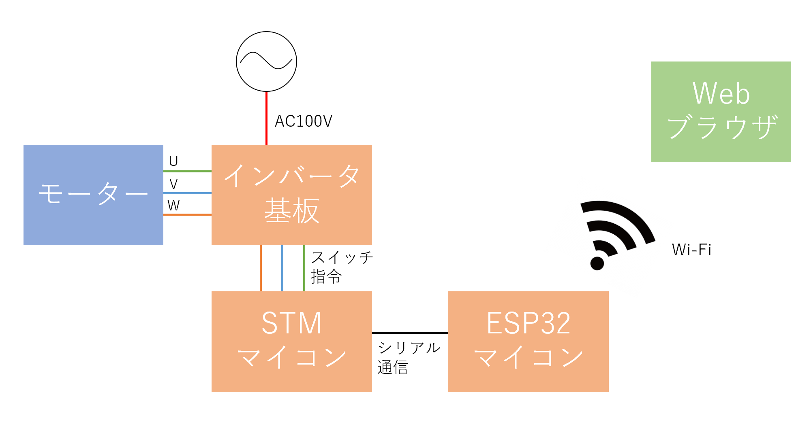

# Web_VVVF_Inverter

Webブラウザ経由でVVVFインバータを制御し、誘導電動機(三相交流モーター)を回します。

# DEMO

システムの全体図はこのような感じになっています。

動作している映像は以下のURLから見ることができます。

https://drive.google.com/file/d/1I6SViRqbRngHkQb4fltIxhX5P07by4WZ/view?usp=sharing

# Features
 
SMT32マイコンについてはC言語で(mbed compiler利用)、ESP32マイコンについてはArduino言語で開発をしています。

インバータ基板は自作基板で、家庭用コンセントから直接電源を取ることができるようになっています。

よく電車に乗る方なら、聞いたことがある音かもしれません。(少し前の世代の電車の音です。)

# Installation
 
それぞれの装置を接続します。

WifiのSSIDとパスワードをArduinoスケッチに書き込んでおいてください。

mbedの方はmain.cppの541行目void pwmOut()をいじると違う車両の音のパラメータを設定することができます。

# Usage
 
ウェブブラウザからESP32マイコンにアクセスすることで、加減速をコントロールする画面が出てきます。
 
# Note
 
古いプログラムなのと、手元に機材がないため動作確認はしていません。

なお、高電圧を扱いますので真似される方は注意してください。

# Author
 
* Miya Abe
* Waseda Univ.